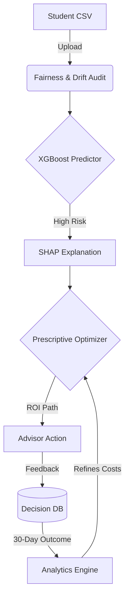

# 🎓 EduGuard — Decision Intelligence for Student Success

> **Beyond Predictive Analytics**  
> EduGuard doesn't just predict who will fail — it **prescribes** exactly how to save them using mathematical ROI optimization and real-world student data.

---

## 🚀 Key Capabilities

| Feature | Technical Core | Impact |
|---|---|---|
| **Predict** | **XGBoost (84% Acc, 0.90 AUC)** | Clinical accuracy in identifying dropout risks. |
| **Explain** | **SHAP (Game Theory)** | Transparent "why" for every student flag (e.g. low attendance). |
| **Optimize** | **Greedy ROI Search** | Prescribes the "minimum effective dose" of intervention. |
| **Learn** | **Closed-Loop Feedback** | Adjusts intervention costs based on 30-day outcomes. |
| **Govern** | **Fairness & Drift Audit** | Ensures ethical AI performance across demographics. |

---

## 📊 The Data (UCI Dataset)
EduGuard is trained on the **UCI Student Dropout and Academic Success** dataset, comprising **4,424 real students**. 
*   **Observations**: 16,000+ data points.
*   **Performance**: Verified **0.906 AUC-ROC** — state-of-the-art for tabular retention modeling.

---

## 🛠️ Tech Stack & Algorithms

*   **Intelligence**: XGBoost (Classifier), SHAP (Interpretability), NumPy (Optimization).
*   **Gateway**: FastAPI (Async REST API), Pydantic (Schema validation).
*   **Interface**: Streamlit (Reactive Advisor Dashboard).
*   **Storage**: SQLAlchemy + SQLite (Intervention Audit Trail).
*   **MLOps**: MLflow (Metric tracking & Reproducibility).

---

## ⚡ Quick Start

### 1. Setup Environment
```bash
pip install -r requirements.txt
```

### 2. Prepare Data & Train
```bash
# Fetch real UCI data (4,424 students)
python scripts/fetch_real_data.py

# Train XGBoost + Log to MLflow
python src/app/models/train.py
```

### 3. Launch Platform
```bash
# Start API (Terminal 1)
py -3 -m uvicorn src.app.main:app --reload

# Start Dashboard (Terminal 2)
py -3 -m streamlit run src/app/dashboard/streamlit_app.py
```
Open **[http://localhost:8501](http://localhost:8501)** and upload `data/sample/students.csv`.

---

## 🏗️ Architecture: The Learning Loop



---

## 🧪 API Endpoints

| Endpoint | Method | Purpose |
|---|---|---|
| `/api/v1/predict` | `POST` | Get risk probability + momentum. |
| `/api/v1/optimize` | `POST` | Get the optimal intervention plan. |
| `/api/v1/explain` | `POST` | Get feature contribution (SHAP). |
| `/api/v1/feedback` | `POST` | Log advisor's qualitative verdict. |
| `/api/v1/outcome` | `POST` | Record actual 30-day risk reduction. |

---

## � Deeper Learning
For a full breakdown of the math (Shapley Values, Gradient Boosting) and implementation details, see internal guide:
👉 **[EduGuard Technical Guide](file:///C:/Users/Sandeep%20Kumar/.gemini/antigravity/brain/7edd3c02-7e00-485d-8c9e-abe6ec329bf1/edu_guard_technical_guide.md)**

---

## 🧪 Testing
```bash
py -3 -m pytest src/app/tests/test_api.py -v
```
Expected: **8/8 PASSED** (Predict, Optimize, Feedback, Outcome, etc.)
